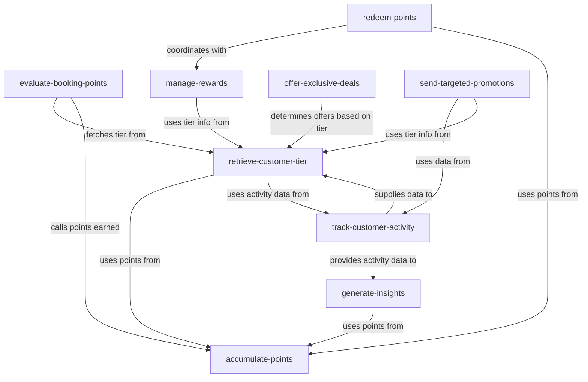

### System design

#### Terms

- `loaylty points (aka points)` - points that can be earned for purchasing services and spent on additional benefits and
  rewards
- `loyalty tier (aka customer tier)` - defines rewards and benefits available to the user with given loyalty tier
- `points tier validity date` - date till when points are used to calculate the loyalty level
- `points spending validity date` - date till when points can be spent on benefits

#### Modules and responsibilities

The below list of modules describes what are the modules and their responsibilities. This is critical to correctly
allocate implementation of features in the correct module. Modules are responsible for behaviors/features (verbs) and
not entities (nouns). This makes the modules smaller and more cohesive. As a result, changes in features/behaviors
requirements should result in local changes (modification of single exciting module or creation of new module).

- `evaluate-booking-points` - Evaluates each booking to determine eligibility and point accrual based on customer's
  current tier and booking specifics. It interacts with `retrieve-customer-tier` to fetch the appropriate loyalty level
  and it calls `accumulate-points`.
- `accumulate-points` - Responsible for recording points earning and spending.
  It publishes current-points balance and their validity dates after each change.
  It's also providing points earning history.
- `retrieve-customer-tier` - manages configuration of loyalty tires and maintains customer tier for each customer based
  on current points balance published by `accumulate-points` and potentially by other activities recorded
  by `track-customer-activity`
- `manage-rewards` - Manages the configuration and availability of various reward options. It uses data
  from `retrieve-customer-tier` to tailor reward offerings to individual customer tiers.
- `redeem-points` - Allows customers to redeem their accumulated points for rewards. This module works closely
  with `manage-rewards` to ensure redemption options are updated and aligned with current offerings.
  It also provides current balance of redeemable points.
- `offer-exclusive-deals` - Provides VIP customers with exclusive offers and early access to promotions, depending on
  their loyalty status, which is determined by `retrieve-customer-tier`.
- `track-customer-activity` - Monitors customer booking activities and spending to support tier upgrades or downgrades.
  It supplies necessary data to `retrieve-customer-tier` and `generate-insights`.
- `generate-insights` - Analyzes data from customer interactions to provide analytics on loyalty program performance,
  including tier distribution and impact on bookings. This module depends on data from `track-customer-activity`
  and `accumulate-points`.
- `send-targeted-promotions` - Uses customer data and loyalty status to send personalized marketing communications, such
  as email or SMS. It depends on data from `track-customer-activity` and `retrieve-customer-tier`.

#### Processes

##### Points earning process

1. `evaluate-booking-points` calculates amount and validity of points that customer earns for particular booking based
   on booking details and `retrieve-customer-tier`.
   `accumulate-points` is called.
2. `accumulate-points` records points and publishes event `CustomerPointsBalanceUpdatedEvent` with current-points balance and their
   validity.
   It also publishes event `CustomerPointsBalanceUpdatedEvent` with points and their validity date.
3. `CustomerPointsBalanceUpdatedEvent` is consumed by
   1. `retrieve-customer-tier` - to update current tier if required
4. `CustomerEarnedPointsEvent` is consumed by
   1. `redem-points` - it creates a record of points that can be redeemed
   2. `generate-insignts` - for analytics

```mermaid
graph TD;
    evaluate-booking-points -->|calculates points| accumulate-points
    accumulate-points -->|publishes| CustomerPointsBalanceUpdatedEvent
    CustomerPointsBalanceUpdatedEvent{{CustomerPointsBalanceUpdatedEvent}} -->|consumed by| retrieve-customer-tier
    accumulate-points -->|publishes| CustomerEarnedPointsEvent
    CustomerEarnedPointsEvent{{CustomerEarnedPointsEvent}} -->|updates redeemable points| redeem-points
    CustomerEarnedPointsEvent -->|record for analytics| generate-insights

    evaluate-booking-points -->|fetches tier info from| retrieve-customer-tier

    classDef default fill:#222,stroke:#000;
    classDef event fill:#555,stroke:000;
    class CustomerPointsBalanceUpdatedEvent,CustomerEarnedPointsEvent event
```

